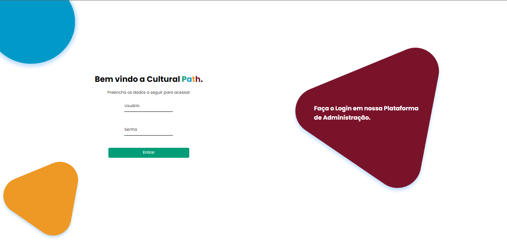
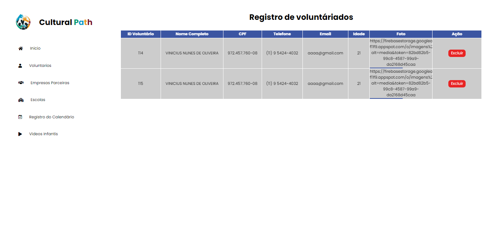
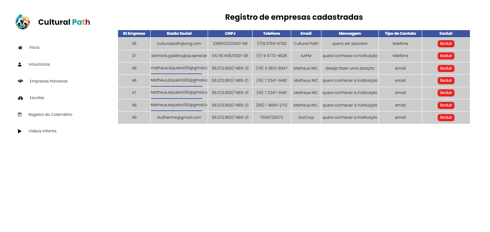
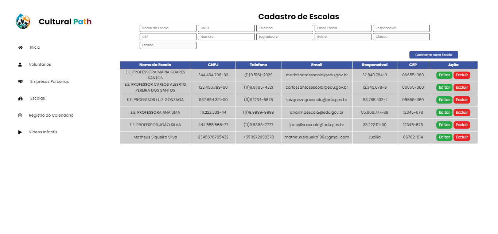
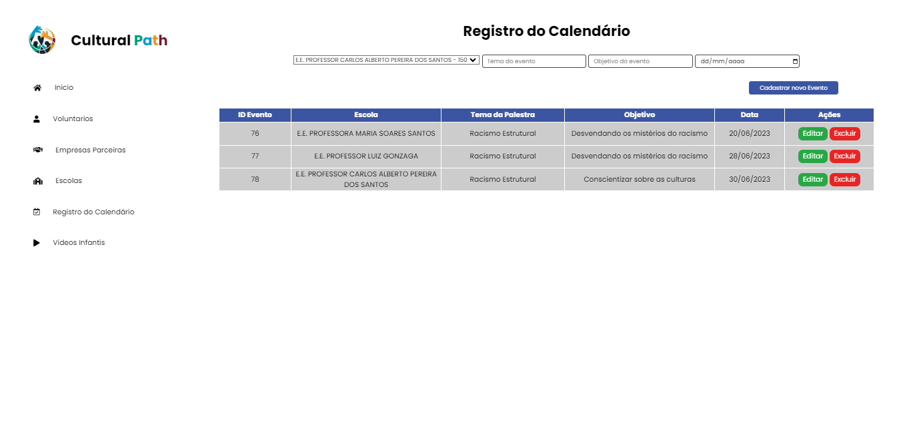
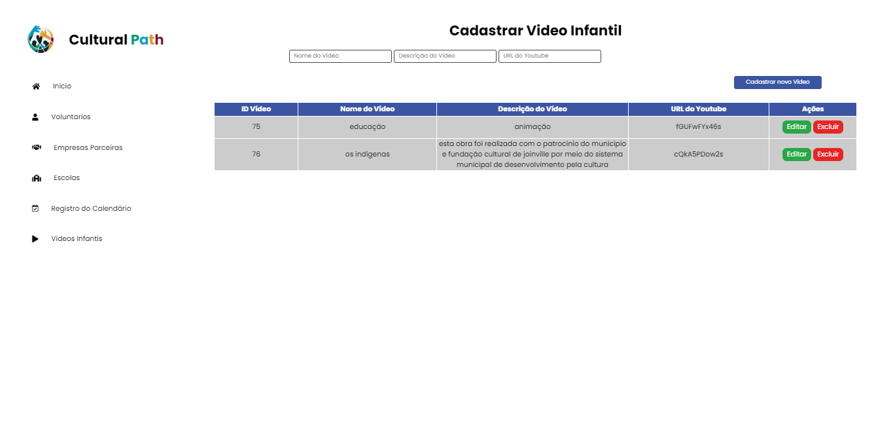

# DASHBOARD - CULTURALPATH

   
<h1>SUMÁRIO</h1>

- [SOBRE](#sobre)
- [HOME](#home)
- [TECNOLOGIAS APLICADAS](#tecnologias-aplicadas)
- [FERRAMENTAS](#ferramentas)
- [CONCEITOS APLICADOS](#conceitos-aplicados)
- [DOCUMENTACAO](#documentacao)
- [COLABORADORES](#colaboradores)

<h1>SOBRE</h1>

Esse projeto foi proposto pelo professor de PWFE (Programação Web Front End), PWBE (Programação Web Back End) e BD (Banco de Dados) com intuito de desenvolvermos uma solução para uma ong ficticia (CULTURAL PATH) onde em conjunto com os responsáveis pelo projeto foi feito o levantamento de requisitos para identificar quais são as necessidades dessa ONG, durante esse levantamento observamos a necessidade de: 

- Calendário
- Formulários
- Quiz

# HOME
|                      DESKTOP               |
| :----------------------------------------- | 
|  |
|  |
|  |
|  |
|  |
|  |

   <h1>TECNOLOGIAS APLICADAS</h1>
       
    
<h1>CONCEITOS APLICADOS</h1>   

- API
- LOCAL STORAGE
- ROUTES
- TOAST
- ROUTER

   <h1>COLABORADORES</h1>

| NOMES                                                                                                                                                                                      |                                                     GITHUB                                                      |                                       FOTO                                       |
| :----------------------------------------------------------------------------------------------------------------------------------------------------------------------------------------- | :-------------------------------------------------------------------------------------------------------------: | :------------------------------------------------------------------------------: |
|       |  | </a> |
|  |  | </a> |
|       |  | </a> |
|       |  | </a> |

